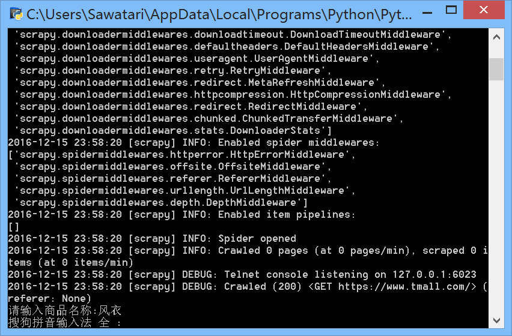

FindGoods
=========
This is a web crawler which can get most popular goods in Tmall. This web crawler based on Scrapy. 



Users can input key words of goods, and after several minutes later a CSV file named "goods.csv" can be generated in the root of this project. In this file, users can get about 170 informations of related goods, they come from the first five pages of Tmall. And they can be sorted based on their scores (sales * 2 + comments).


Of course, this table also be shown in TreeView of the form. The goods are arranged in descending order of scores. When users click any of the items, browser will automatically start and open the purchase page.


The code of getting information of goods:

```python
gifts = sel.xpath('//*[@id="J_ItemList"]/div[@class="product  "]')
    for gift in gifts:
        name = gift.xpath('div/p[@class="productTitle"]/a/@title').extract()
        # 天猫电器城HTML结构不同
        if not name:
            name = gift.xpath('div/div[@class="productTitle productTitle-spu"]/a[1]/text()').extract()

        shop = gift.xpath('div/div[@class="productShop"]/a[@class="productShop-name"]/text()').extract()
        price = gift.xpath('div/p[@class="productPrice"]/em/@title').extract()
        trading = gift.xpath('div/p[@class="productStatus"]/span[1]/em/text()').extract()
        review = gift.xpath('div/p[@class="productStatus"]/span[2]/a/text()').extract()
        url = gift.xpath('div/p[@class="productTitle"]/a/@href').extract()
        if not url:
            url = gift.xpath('div/div[@class="productTitle productTitle-spu"]/a[1]/@href').extract()
```
There are some blogs about this project (simplified Chinese):

[http://blog.csdn.net/osawatari/article/details/53716836](http://blog.csdn.net/osawatari/article/details/53716836)

[http://blog.csdn.net/osawatari/article/details/53717698](http://blog.csdn.net/osawatari/article/details/53717698)

[http://blog.csdn.net/osawatari/article/details/53718400](http://blog.csdn.net/osawatari/article/details/53718400)

